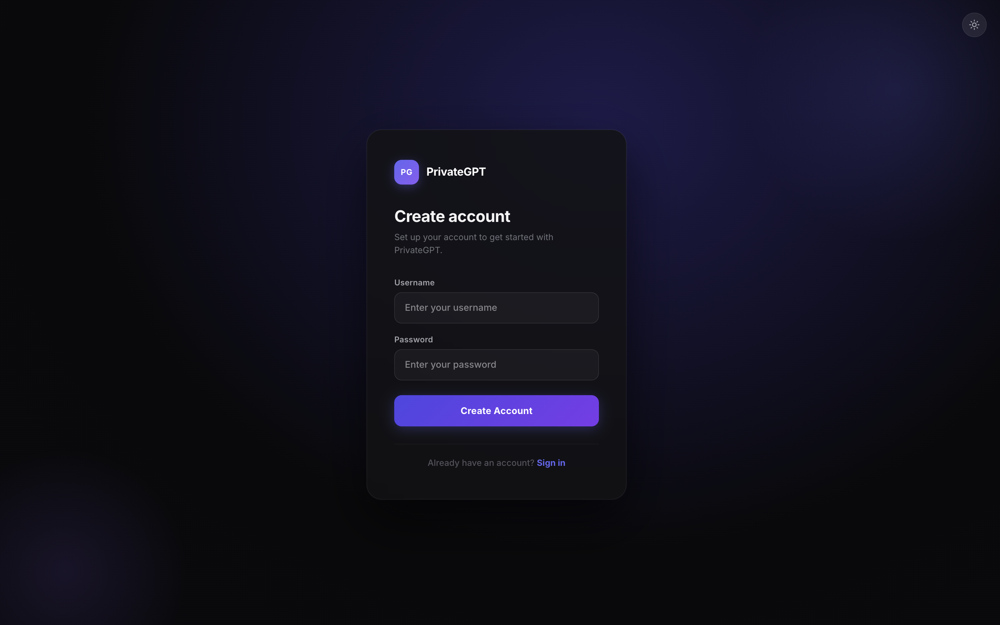
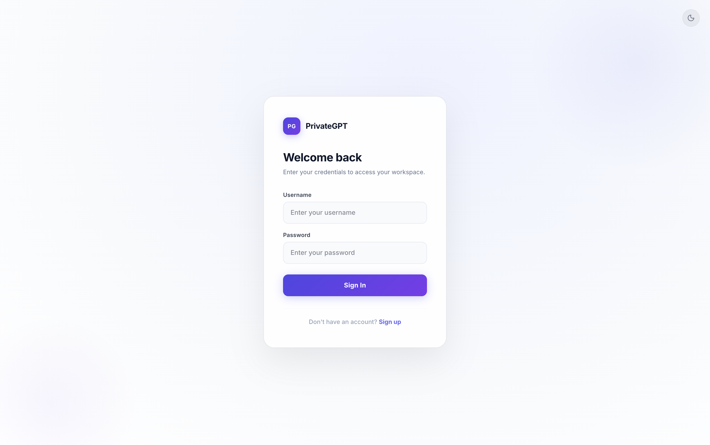
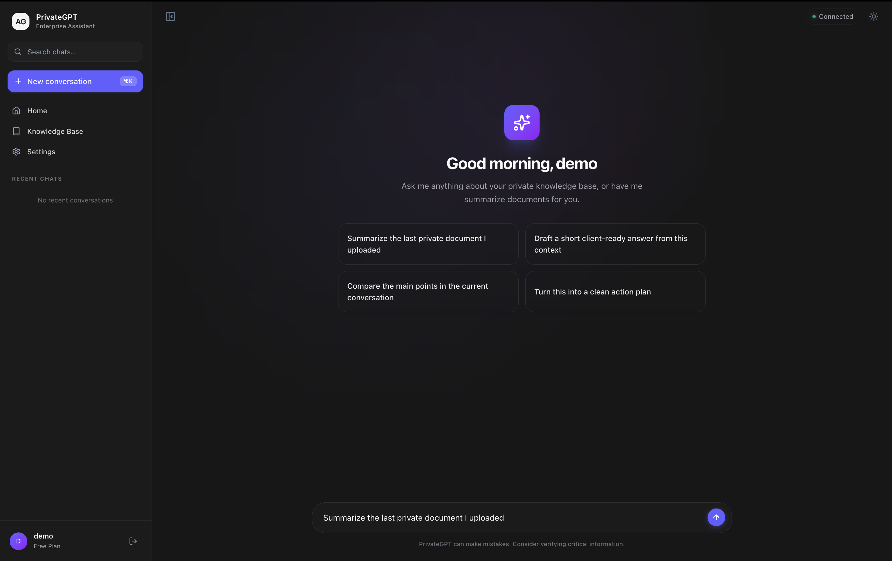
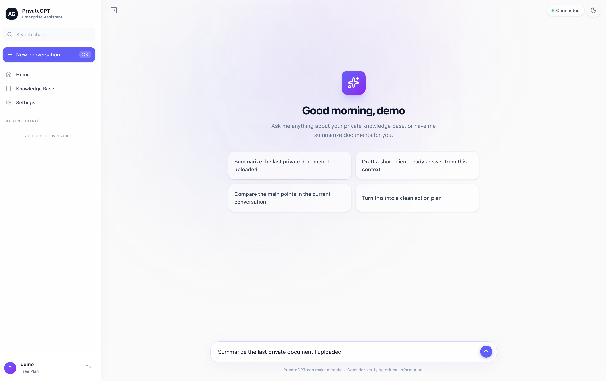

# PrivateGPT – Local AI Chat UI

A modern, privacy-first chatbot frontend built with **React + Vite** and styled with **Tailwind CSS v4**. Supports light/dark mode, JWT-based authentication, and connects to a configurable backend API.

## Screenshots

### 🔐 Authentication Page

| Dark Mode | Light Mode |
|---|---|
|  |  |

### 💬 Chat Interface

| Dark Mode | Light Mode |
|---|---|
|  |  |

## Install and Run

1. Install dependencies:

```bash
npm install
```

2. Start the development server:

```bash
npm run dev
```

3. Open the app in your browser:

```text
http://127.0.0.1:3000
```

If you want to point the app at your own backend, create a `.env` file in the project root and set:

```env
VITE_API_BASE=http://localhost:8000
VITE_AUTH_API=http://localhost:8001
```

Then restart the dev server.

Currently, two official plugins are available:

- [@vitejs/plugin-react](https://github.com/vitejs/vite-plugin-react/blob/main/packages/plugin-react) uses [Oxc](https://oxc.rs)
- [@vitejs/plugin-react-swc](https://github.com/vitejs/vite-plugin-react/blob/main/packages/plugin-react-swc) uses [SWC](https://swc.rs/)

## React Compiler

The React Compiler is not enabled on this template because of its impact on dev & build performances. To add it, see [this documentation](https://react.dev/learn/react-compiler/installation).

## Expanding the ESLint configuration

If you are developing a production application, we recommend using TypeScript with type-aware lint rules enabled. Check out the [TS template](https://github.com/vitejs/vite/tree/main/packages/create-vite/template-react-ts) for information on how to integrate TypeScript and [`typescript-eslint`](https://typescript-eslint.io) in your project.

---

How to configure production endpoints
------------------------------------

Create a `.env` (or `.env.production`) with the following values to point the frontend at your production backend:

```env
VITE_API_BASE=https://api.yourdomain.com
VITE_AUTH_API=https://auth.yourdomain.com
```

Before deploying to production
-----------------------------

- Build with `npm run build` and deploy the `dist/` output.

